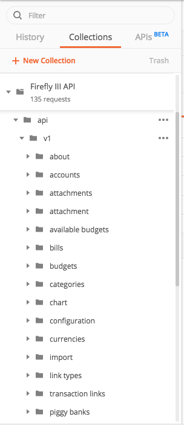

# API docs generator
This is a very basic script that renders the YAML file (in the OpenAPI 3.0 spec) that is used as the source for Firefly III's API documentation. I wrote it because the API YAML file was well over 1400 lines before I got sick of editing such a large file. The current stitched result is well over 7500 lines at the time of writing.


## How it works
What it does is simply join all YAML files in `/yaml/` together, preceded by the `start.yaml.twig` file in the `/templates/` directory.

1. Rename `.env.example` to `.env` and adjust the variables accordingly, e.g.

    ```ini
    API_VERSION=0.10.0
    API_DESTINATION=./
    API_ROOT=./
    ```

2. Install dependencies via [Composer](https://getcomposer.org/)

    `$ composer install`

3. Install PHP `yaml.so` extension. It should be added to your `php.ini` automatically.

    `$ pecl install yaml`

4. Generate `firefly-iii-${API_VERSION}.yaml` file

    `$ php index.php`

The resulting `firefly-iii-${API_VERSION}.yaml` file can be imported into your favorite API development environment to play around with, e.g. [Postman](https://www.getpostman.com/).



## Current state
I'm actively writing all API documentation, so the file may change.

## Contributing
Feel free to create a PR on anything. If you want to change endpoints, check out `/yaml/paths`. Or edit objects in `/yaml/schemas`. This is my first API document so feel free to tell me how to improve.

## See the result
You can see the result [on this page](https://api-docs.firefly-iii.org/).
